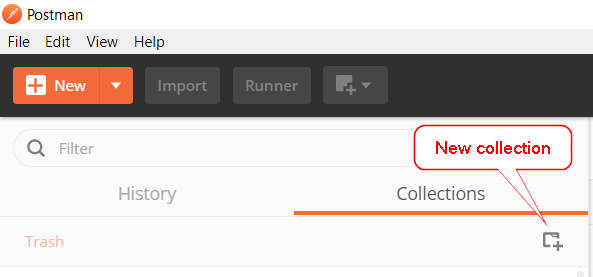
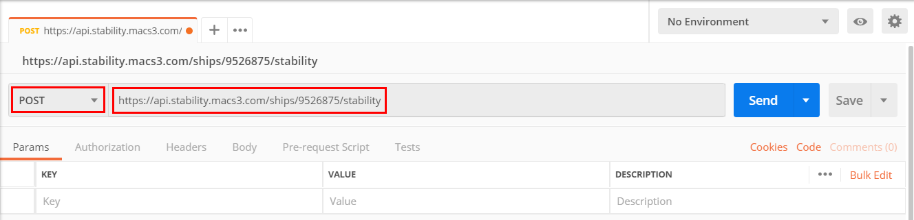
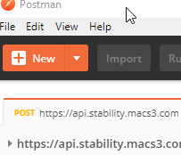
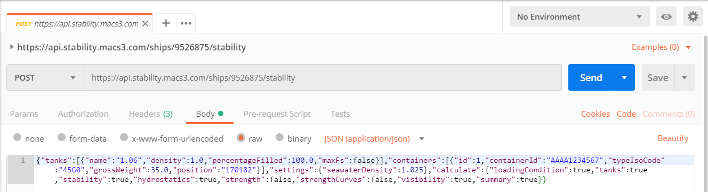
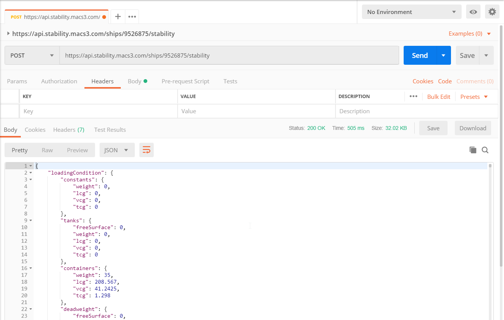

# [Get Postman](https://www.getpostman.com )
Download, install and run Postman from [https://www.getpostman.com](https://www.getpostman.com )

## Create a new Postman-Collection
If you are new to Postman, create a new collection named e.g. "Navis NCVS Services" that will help you to organize the requests that you will setup in the next steps.

## Setup a request to call a service-endpoint
Consult the [service documentation](https://api.stability.macs3.com) for details like endpoint (route) you want to setup. It might be a POST or GET verb and the route will contain a placeholder for the IMO-Number.

Set the verb to POST\
Set the route to https://api.stability.macs3.com/ships/9526875/stability\
Adjust the IMO-Number in the route

### Headers
Click the Headers-Option\
Set a key [Authorization] and specify your company API-Key. NOTE: prepend your API-Key with "ApiKey<space>"\
Set a key [Accept] as application/json\
Set a key [Content-Type] as application/json\

### Body
Click the Body-Option and select RAW\

Fill in the parameters to send allong with the request as JSON\

### Send request and get response
Click SEND\
Consult the [service documentation](https://api.stability.macs3.com) for details about the returned http-status-code and result.

[back](README.md)
