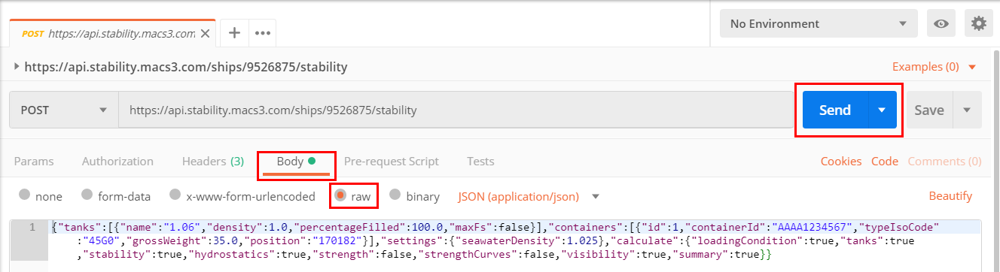
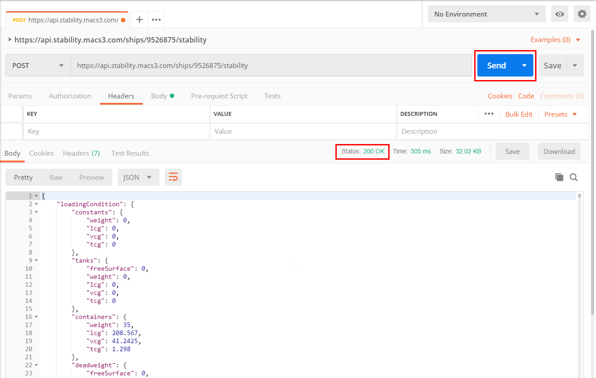

# Postman: Explore the stability service
Download, install and run Postman from [https://www.getpostman.com](https://www.getpostman.com )

## 1. Create a new Postman-Collection
If you are new to Postman, create a new collection named e.g. "Navis NCVS Cloud Services" that will help you to organize the requests that you will setup in the next steps.


## 2. Setup a request to call a service-endpoint
Consult the [service documentation](https://api.stability.macs3.com) for the details to setup.

* Set the verb to `POST`.  
* Set the route to https://api.stability.macs3.com/ships{imoNumber}/stability  
* Replace the {imoNumber} in the route with the IMO-Number (9526875).


### 3. Specify `Header` details
* Click `Headers`.  
* Set a key `Authorization` and specify your company API-Key. NOTE: prepend your API-Key with "ApiKey" and a space.  
* Set a key `Accept` as application/json.  
* Set a key `Content-Type` as application/json.  


### 4. Specify `Body` details
* Select `Body`.
* Select `RAW`  
* Fill the parameters in JSON-Notation. This is often the tricky part and requires an intense inspection of the [service documentation](https://api.stability.macs3.com). For the walk-trough, please use the JSON-Snippet below.   

```
{"tanks":[{"name":"5DBP","density":1.025,"percentageFilled":50.0,"maxFs":false}],"containers":[{"id":1,"containerId":"AAAU1234567","typeIsoCode":"22G0","grossWeight":14.0,"position":"170182"}],"constants":[{"name":"Deadweight constant","weight":676.0,"lcg":79.27,"vcg":7.65,"tcg":0.0,"wda":-4.6,"wdf":295.0}],"settings":{"seawaterDensity":1.025},"calculate":{"loadingCondition":true,"tanks":true,"stability":true,"hydrostatics":true,"strength":false,"strengthCurves":false,"visibility":true,"summary":true}}
```


### 5. Send the request and get response
* Click `SEND`

Consult the [service documentation](https://api.stability.macs3.com) for details about the returned http-status-code and result.



[back](README.md)
