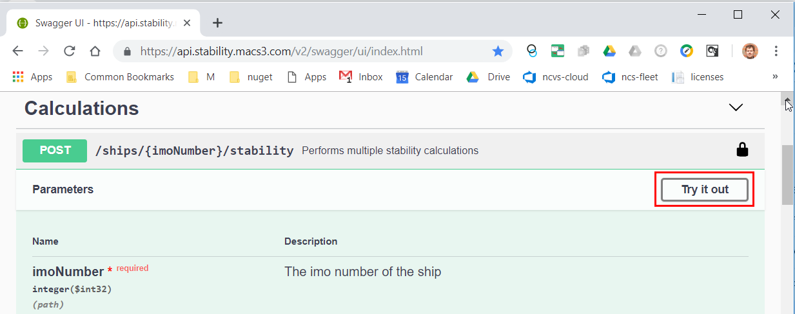
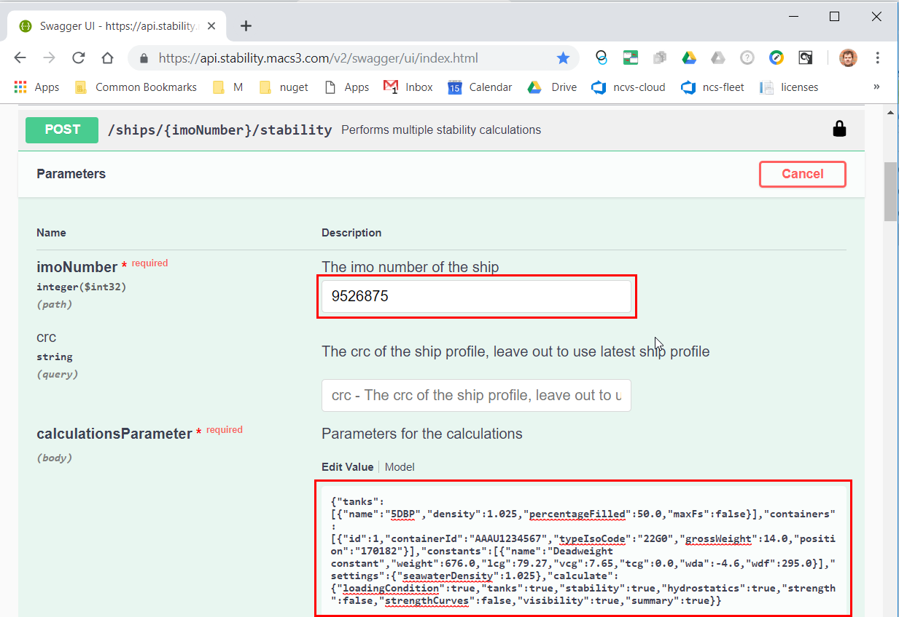

# Swagger: Explore the stability service

## 1. Open the service documentation

* Use your webbrowser to navigate to https://api.stability.macs3.com 


## 2. Authorize with your company API-Key

* NOTE: Prepend your API-Key with "ApkiKey<space>".
* Click [Authorize].


## 3. Select an endpoint to test

* Navigate to [POST]/ships/{imonumber}/stability.  
* Click [Try it out]



## 4. Specify details for the request

* Fill in the imoNumber of the vessel.  
* Fill in the calculationsParameter in JSON-Notation. This is often the tricky part and requires an intense inspection of the documentation. Please use the following JSON-Snippet.   
* Hit [Execute].  

```
{"tanks":[{"name":"5DBP","density":1.025,"percentageFilled":50.0,"maxFs":false}],"containers":[{"id":1,"containerId":"AAAU1234567","typeIsoCode":"22G0","grossWeight":14.0,"position":"170182"}],"constants":[{"name":"Deadweight constant","weight":676.0,"lcg":79.27,"vcg":7.65,"tcg":0.0,"wda":-4.6,"wdf":295.0}],"settings":{"seawaterDensity":1.025},"calculate":{"loadingCondition":true,"tanks":true,"stability":true,"hydrostatics":true,"strength":false,"strengthCurves":false,"visibility":true,"summary":true}}
```



## 5. Check the response

* If everything is fine, the response is usually a http-status-code of 200.  
* Consult the built-in documentation to understand the response.  


[back](README.md)
